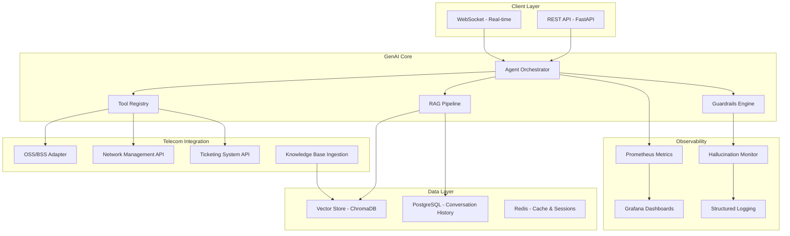

# Telecom GenAI Platform

An enterprise-grade GenAI integration platform for telecom automation, featuring RAG pipelines, agentic workflows, tool-calling, and API integration with OSS/BSS systems.

Built to demonstrate production-ready patterns for integrating LLM capabilities into telecom operations workflows.

## Architecture



## Features

### RAG Pipeline
- Document ingestion from structured (CSV, JSON, XML) and unstructured (PDF, docs) telecom data
- Chunking strategies optimized for technical documentation (network configs, runbooks, SLA documents)
- Vector embeddings with configurable models (OpenAI, local alternatives)
- Hybrid search: semantic + keyword for technical terminology
- Source attribution and confidence scoring

### Agentic Workflows
- Multi-step reasoning with tool-calling for network diagnostics
- Function execution against simulated OSS/BSS APIs
- Conversation memory with PostgreSQL persistence
- Configurable reasoning chains with retry logic

### Telecom-Specific Tools
- **Network Health Check**: Query network element status via REST API
- **Ticket Creator**: Auto-generate incident tickets from AI analysis
- **SLA Monitor**: Check SLA compliance and generate alerts
- **Config Validator**: Validate network configuration changes against policies
- **Capacity Planner**: Analyze traffic patterns and recommend scaling

### Guardrails & Safety
- Input validation and prompt injection detection
- Output filtering for PII and sensitive network data
- Hallucination detection using source grounding scores
- Response confidence thresholds with human-in-the-loop escalation
- Audit logging for compliance

### Monitoring & Observability
- Prometheus metrics: latency, token usage, error rates, hallucination scores
- Grafana dashboards for real-time AI system health
- Structured JSON logging with correlation IDs
- Model quality tracking over time

## Tech Stack

| Component | Technology |
|-----------|-----------|
| API Framework | FastAPI (Python) |
| LLM Integration | LangChain / LiteLLM |
| Vector Database | ChromaDB |
| Database | PostgreSQL |
| Cache | Redis |
| Containerization | Docker + Docker Compose |
| Orchestration | Kubernetes (Helm charts) |
| IaC | Terraform (Azure) |
| CI/CD | GitHub Actions |
| Monitoring | Prometheus + Grafana |
| Testing | pytest + httpx |

## Quick Start

### Prerequisites
- Docker and Docker Compose
- Python 3.11+
- OpenAI API key (or compatible LLM endpoint)

### Run locally
```bash
# Clone the repository
git clone https://github.com/mariusmiclau/telecom-genai-platform.git
cd telecom-genai-platform

# Copy environment config
cp .env.example .env
# Edit .env with your API keys

# Start all services
docker-compose up -d

# Ingest sample telecom documentation
python src/rag_pipeline/ingest.py --source docs/sample_data/

# API available at http://localhost:8000
# Grafana dashboard at http://localhost:3000
```

### Run tests
```bash
pytest tests/ -v
```

## Project Structure

```
telecom-genai-platform/
├── src/
│   ├── api/              # FastAPI endpoints
│   │   ├── main.py        # Application entry point
│   │   ├── routes.py      # API routes
│   │   └── models.py      # Pydantic request/response models
│   ├── rag_pipeline/      # RAG implementation
│   │   ├── ingest.py      # Document ingestion and chunking
│   │   ├── embeddings.py  # Embedding generation
│   │   ├── retriever.py   # Hybrid search retriever
│   │   └── chain.py       # RAG chain with source attribution
│   ├── agents/            # Agentic workflows
│   │   ├── orchestrator.py # Main agent orchestrator
│   │   ├── reasoning.py   # Multi-step reasoning engine
│   │   └── memory.py      # Conversation memory management
│   ├── tools/             # Telecom-specific tool implementations
│   │   ├── registry.py    # Tool registration and discovery
│   │   ├── network.py     # Network health check tools
│   │   ├── ticketing.py   # Ticket creation tools
│   │   ├── sla.py         # SLA monitoring tools
│   │   └── config.py      # Config validation tools
│   ├── guardrails/        # Safety and compliance
│   │   ├── input_filter.py    # Prompt injection detection
│   │   ├── output_filter.py   # PII and data filtering
│   │   ├── hallucination.py   # Hallucination detection
│   │   └── audit.py           # Audit logging
│   └── monitoring/        # Observability
│       ├── metrics.py     # Prometheus metrics
│       └── logging.py     # Structured logging
├── infrastructure/
│   ├── docker/            # Dockerfiles
│   ├── k8s/               # Kubernetes manifests and Helm charts
│   └── terraform/         # Azure infrastructure
├── tests/                 # Test suite
├── docs/
│   ├── sample_data/       # Sample telecom documents for RAG
│   └── architecture.md    # Detailed architecture decisions
├── docker-compose.yml
├── .env.example
├── .github/workflows/     # CI/CD pipelines
├── pyproject.toml
└── README.md
```

## Design Decisions

### Why RAG over Fine-Tuning?
For telecom operations, documentation changes frequently (network configs, runbooks, SLA terms).
RAG allows real-time updates without retraining. Fine-tuning would create stale models that
drift from current network state.

### Why Hybrid Search?
Telecom documentation contains highly specific technical terms (PCRF, HLR, SMSC, VMS) that
pure semantic search misses. Hybrid search combines BM25 keyword matching with vector
similarity to handle both natural language queries and exact technical lookups.

### Why Guardrails First?
In telecom, an AI hallucinating a network configuration change could cause outages affecting
thousands of users. Every response is grounded against source documents with confidence
scoring. Below-threshold responses trigger human-in-the-loop escalation rather than
autonomous action.

### Why Tool-Calling Architecture?
Network operations require real-time data. The agent doesn't guess network status from
training data. Instead, it calls live APIs (simulated in this demo) to get current state,
then reasons about the results. This pattern ensures responses reflect actual network
conditions.

## API Endpoints

| Method | Endpoint | Description |
|--------|----------|-------------|
| POST | `/api/v1/chat` | Send a message to the AI agent |
| POST | `/api/v1/ingest` | Ingest documents into RAG pipeline |
| GET | `/api/v1/health` | System health check |
| GET | `/api/v1/metrics` | Prometheus metrics endpoint |
| WS | `/api/v1/ws/chat` | WebSocket for streaming responses |

## Sample Interactions

```
User: "What's the current status of the core network in Region A?"

Agent: [Calls network_health_check tool for Region A]
       [Retrieves relevant SLA thresholds from knowledge base]
       [Compares current metrics against SLA targets]

Response: "Region A core network is operational. Current availability
is 99.97%, which is above the SLA target of 99.95%. However, I've
detected elevated latency on 2 of 12 nodes (Node-7: 45ms, Node-11: 52ms)
against a baseline of 20-25ms. This could indicate early congestion.
Shall I create a proactive incident ticket?"

Sources: [SLA-Document-v3.2, Section 4.1], [Network-Runbook, Chapter 7]
Confidence: 0.94
```

## Monitoring Dashboard

The Grafana dashboard tracks:
- **Request latency** (p50, p95, p99)
- **Token usage** per request and cumulative
- **Hallucination score** distribution
- **Tool call success/failure** rates
- **RAG retrieval relevance** scores
- **Active conversations** and session duration

## License

MIT

## Author

**Marius Miclau** - Integration Architect | Azure Cloud & API Platform Specialist
- 17+ years enterprise integration across telecom, energy, and logistics
- [LinkedIn](https://linkedin.com/in/mariusmiclau)
- [X/Twitter](https://x.com/MiclauMarius)
